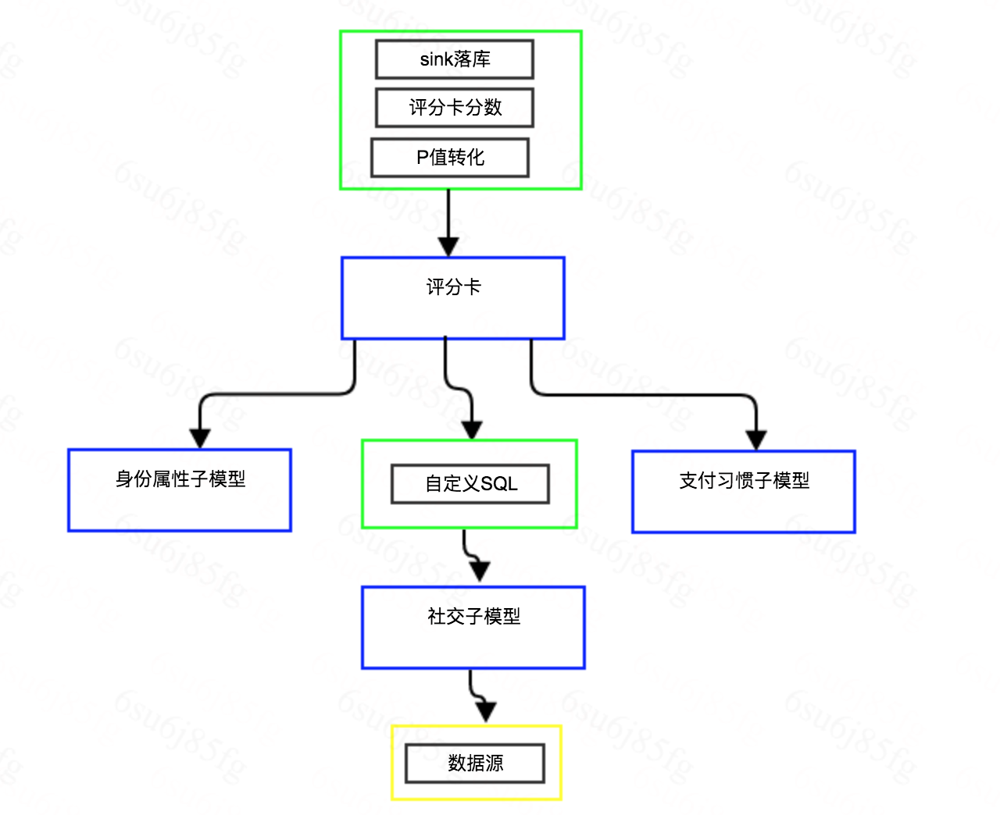

# spark PMML 模型离线部署

## 介绍
针对离线模型越来越多的部署需求，每个任务单独开发spark任务效率低下，通过配置模型执行流图可大大提高部署效率。

下面简单介绍下思路

离线模型部署主要有四步

- 特征准备
- 特征预处理
- 执行模型逻辑
- 结果持久化

总体逻辑可类比树结构处理，如图

上图，蓝色为模型节点，绿色为transformer节点，黄色为children节点(下面3个子模型都是乘客曼指数3的子节点)

一个节点由children预处理节点，自身处理，transformer后继处理组成，多个节点构成了一个树结构(可类比为DAG，不过一个节点只有一个父节点)

children多个子节点通过Join连接，可配置join模式和关联key

由于需要支持多语言(Python/R...)模型部署，现模型暂只支持PMML(参考)格式，原则上不强求PMML包含特征预处理，携带了当然更好。

## 举例
```
sparkConf:
  #spark任务名称， 必填
  appName: driverCCardPMML
  #是否启用hive支持
  enableHiveSupport: true
  #spark其它配置选项，如内存，shffle partitions数量等
appConf:
  #debug开启时，每个节点会做持久化
  debug: true
  #持久化数量，0代表全量
  limit: 10
  savePath: /user/model/model_deploy/
  sourcePath: /user/model/model_source/
#一个子节点只有一个父节点，所以树更合适
tree:
  #节点描述
  desc: C卡PMML
  #名称，用于标识一个组件
  name: model_pmml
  #传递给组件的参数，包括模型超参数，以及配置参数等
  parameters:
    #pmml文件路径，暂只支持本地文件，spark-submit可通过--files glm1.pmml上传
    pmmlPath: scorecard_v1.pmml
    #是否排除原始列，默认false(保留)
    excludeOriginColumn: true
    #排除例外，如uid等
    excludeExcept: ["uid"]
  #子节点合并所有结果，如果children只有一个，可省略joinType，joinKey
  #join类型，full(默认)， inner， left， right
  children:
    - desc: 加载C卡原数据
      name: data_source
      parameters:
        #支持hql， hql_file json
        type: hql_file
        path: datasource.sql
        #方便模型校验，可配置saveTable，将负责数据源落库，将会保存到/user/model/model_source/year/month/day/model_card_source.parquet
        saveTable: model_card_source
      transformer:
        - desc: 数据类型转换
          name: feature_data_type
          parameters:
            #原始数据类型 tinyint，smallint， int， bigint， float， double，string， decimal
            originalType: ["decimal"]
            #目标数据类型
            targetType: double
            #排除的列名，可省略 
            #exceptColumn: []       
  #transformer节点，pipeline模式
  transformer:
    - desc: 落库
      name: data_sink
      parameters:
        #是否自动建表
        auto: true
        path: /user/model/
        db: model_result
        table: model_card_v1
        tableName: 模型-评分卡-v1
``` 

## 部署
配置application.yaml，准备好需要的PMML模型文件以及需要的sql文件，注意：资源文件需要在当前目录下

```
spark-submit -v --class org.pmml.deploy.App  pmml-deploy-executable-1.0-SNAPSHOT-online.jar year:2019 month:01 day:01
   
```
注意
year，month，day参数必须传递，用于支持调度回溯，变量格式为k:v
application.yaml，和其它资源文件可通过{variable}引用命令行的变量

## Q&A
- 需要新的算子怎么办？

如果暂时不支持的话，可能需要开发了，开发新算子的成本很低，可参考Source.scala

- 模型更新如何解决？

为了方便模型更新，数据来源不建议再建hive表，方便原始数据校验datasource可配置saveTable选项，会将结果保存为parquet文件，如/user/model/model_source/2018/10/07/model_card_source.parquet
然后更新pmml文件即可

- 模型如何监控？

后续会添加评价指标算子，如psi,auc等，包括预警功能，待产品设计，添加后，更新该文档。

- 保存的parquet文件，如何查询？

parquet自带了schema信息，可在spark-sql模式下如下查询
```
CREATE TEMPORARY VIEW parquetTable
USING org.apache.spark.sql.parquet
OPTIONS (
  path "/user/fbi/model_source/2018/10/07/model_driver_c_card_source.parquet"
)
desc parquetTable;
SELECT * FROM parquetTable limit 2;
```
- 开启debug模式后，如何查看中间结果？

每一个组件都有唯一的uid编号，开启debug模式后，会根据配置保存几条中间数据，保存路径可在执行日志中查找
```
2019-03-13 18:42:21 INFO org.pmml.deploy.Schedule process 数据类型转换
2019-03-13 18:42:21 INFO org.pmml.deploy.handler.Handler 组件:feature_data_type,参数:Map(originalType -> [decimal], targetType -> double)
2019-03-13 18:42:21 INFO org.pmml.deploy.Schedule process 数据类型转换 start, uid:56cb5e58d83749ec9b64859cc3492cfd
...
2019-03-13 18:20:38 INFO org.pmml.deploy.handler.feature.ChangeDataType save path:/user/model/model_deploy/20190310/c57ec5c918064b11b663e0476de15c91.parquet
```

- 是否有计划添加其它模型格式支持？

暂时只支持PMML格式，但由于PMML格式的缺陷，如神经网络支持有限，复杂模型执行较慢等，后期有需求时也会添加其它模型格式，包括原生模型格式(如xgb)，tensorflow等支持。

针对Python pickle模式的支持，可作为探索性性质，参考jep

 

 

 

  